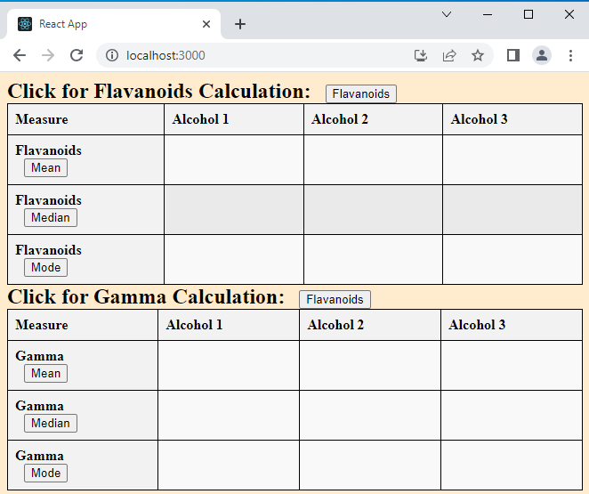
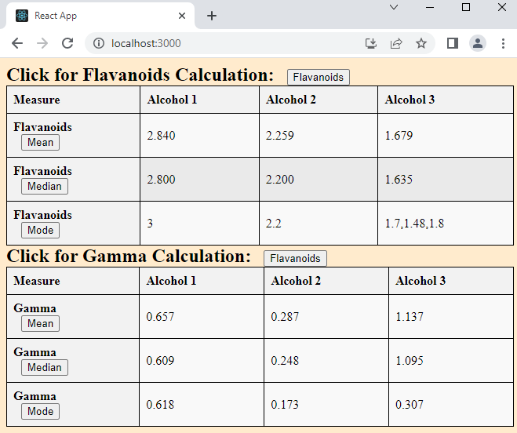

## Project Description

- This project focuses on developing utility functions to perform calculations on a dataset and display the results as React components in a tabular format.
- The dataset contains information about different classes of alcohol, and the goal is to calculate various statistical measures for the "Flavanoids" property and a newly created property called "Gamma".

## Initial



## Final



## Tools used

- React JS
- HTML
- Inline Css

## How to test

run on your machine:

clone project

```
git clone https://github.com/
```

go to projet

```
cd data-visualization-app
```

install npm

```
npm install
```

start project

```
npm start
```

## Comments

- For demonstration purposes, the application has a default list of 3 tasks.

- You can click "mean", "median and "mode" button to caluclate 3 tasks on the data set.
